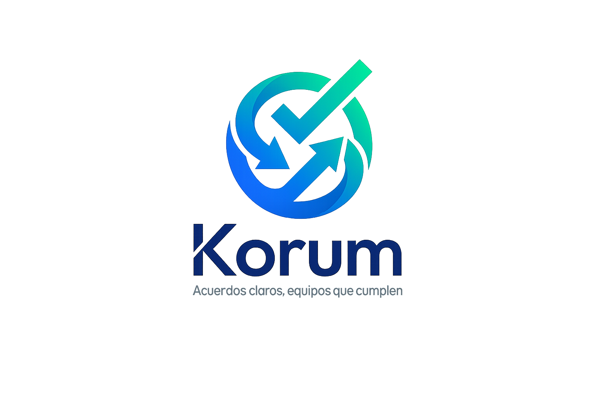

<p align="center">
  
</p>

# Korum

Korum es una plataforma web para gestionar reuniones, minutas y compromisos con trazabilidad completa.
Está construida con Laravel + Inertia + React, orientada a equipos que necesitan convertir decisiones en acuerdos ejecutables y medibles.

## Funcionalidades principales

- Gestión de reuniones: creación, edición, cancelación y seguimiento por estado.
- Agenda y participantes por reunión (internos y externos).
- Publicación de minutas con temas, decisiones y acuerdos.
- Seguimiento de acuerdos con historial de avances y porcentaje de progreso.
- Notificaciones en app + correo cuando hay cambios o vencimientos próximos.
- Exportación de actas a PDF.
- Búsqueda rápida global de reuniones y acuerdos.
- Panel de administración para departamentos, usuarios, roles y tipos de reunión.
- Inicio de sesión tradicional + autenticación con Google (Socialite).

## Stack técnico

- Backend: Laravel 12, PHP 8.2+
- Frontend: React 18 + Inertia.js 2
- UI: Tailwind CSS 4 + DaisyUI + Framer Motion + Lucide Icons
- Auth/Permisos: Laravel Breeze + Sanctum + Spatie Permission
- Exportación: `barryvdh/laravel-dompdf`
- Build: Vite 7

## Requisitos

- PHP 8.2 o superior
- Composer
- Node.js 20+ y npm
- Base de datos: SQLite (default) o MySQL/PostgreSQL

## Instalación local

1. Instalar dependencias:

```bash
composer install
npm install
```

2. Crear entorno y clave:

```bash
cp .env.example .env
php artisan key:generate
```

3. Configurar base de datos en `.env` y ejecutar migraciones + seed:

```bash
php artisan migrate --seed
```

4. Crear enlace simbólico para adjuntos públicos:

```bash
php artisan storage:link
```

5. Levantar entorno de desarrollo completo:

```bash
composer run dev
```

Ese comando inicia servidor web, worker de cola, logs con Pail y Vite en paralelo.

## Credenciales de prueba (Seeder)

- Admin: `admin@korum.cl` / `password`
- Usuario: `juan.perez@korum.cl` / `password`
- Usuario: `maria.gonzalez@korum.cl` / `password`

## Variables de entorno importantes

- `APP_NAME`, `APP_URL`
- `DB_CONNECTION`, `DB_HOST`, `DB_PORT`, `DB_DATABASE`, `DB_USERNAME`, `DB_PASSWORD`
- `QUEUE_CONNECTION` (recomendado: `database`)
- `MAIL_MAILER`, `MAIL_HOST`, `MAIL_PORT`, `MAIL_USERNAME`, `MAIL_PASSWORD`, `MAIL_FROM_ADDRESS`
- `GOOGLE_CLIENT_ID`, `GOOGLE_CLIENT_SECRET`, `GOOGLE_REDIRECT_URI`

## Colas y tareas programadas

Korum usa:

- Cola para procesamiento de notificaciones.
- Scheduler para recordar acuerdos próximos a vencer.

Comandos útiles:

```bash
php artisan queue:listen --tries=1 --timeout=0
php artisan schedule:work
php artisan app:check-deadlines
```

La tarea `app:check-deadlines` se agenda diariamente a las `08:00` y notifica acuerdos con vencimiento en 2 días.

## Estructura funcional del dominio

- Reuniones (`Meeting`): cabecera de sesión, tipo, área, organizador, estado.
- Minutas (`MeetingMinute`): resumen, observaciones, decisiones y temas.
- Acuerdos (`Agreement`): compromiso, responsables, fecha y estado.
- Avances (`AgreementUpdate`): bitácora de progreso por acuerdo.
- Adjuntos (`Attachment`): archivos asociados a reunión o acuerdo.
- Auditoría (`AuditLog`): trazabilidad de cambios.

## Comandos de calidad

```bash
php artisan test
./vendor/bin/pint
npm run build
```

## Notas de operación

- El login con Google requiere configurar las credenciales OAuth en `.env`.
- La exportación PDF de minutas usa la vista `resources/views/pdf/minute.blade.php`.
- Los adjuntos se guardan en `storage/app/public/attachments/*` con límite de 10 MB por archivo.

## Seguridad

- Nunca subas `.env` al repositorio.
- Usa `.env.example` como referencia para nuevas instalaciones.
