# Manual de Usuario Basico - Korum

## 1. Objetivo del manual
Este manual explica, paso a paso, como usar Korum para:
- ingresar a la plataforma,
- revisar reuniones,
- gestionar asistencia,
- preparar y revisar minutas,
- consultar acuerdos,
- actualizar datos de perfil.

Esta guia esta orientada a usuarios basicos (sin conocimientos tecnicos).

## 2. Requisitos minimos
- Tener usuario y clave de acceso.
- Tener navegador web actualizado (Chrome, Edge o Firefox).
- Tener conexion a internet estable.

## 3. Ingreso al sistema
1. Abre Korum en tu navegador.
2. Ingresa tu correo y clave.
3. Presiona **Log in**.

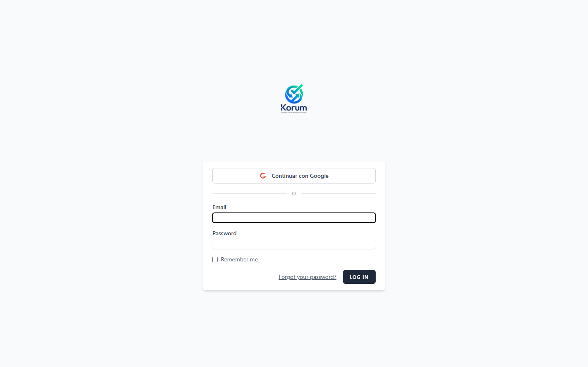

Si el acceso es correcto, veras el panel principal.

## 4. Dashboard (panel principal)
En el dashboard puedes ver accesos rapidos a los modulos principales.

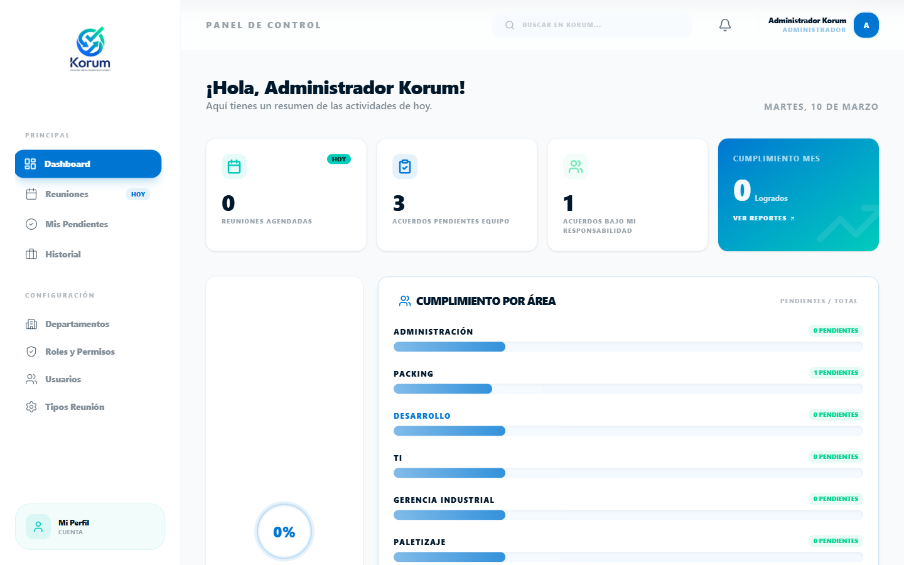

Recomendacion para usuarios nuevos:
1. Revisa el menu lateral.
2. Entra primero a **Reuniones** para comenzar el flujo normal de trabajo.

## 5. Modulo Reuniones (listado)
En **Reuniones** puedes ver todas las reuniones disponibles.

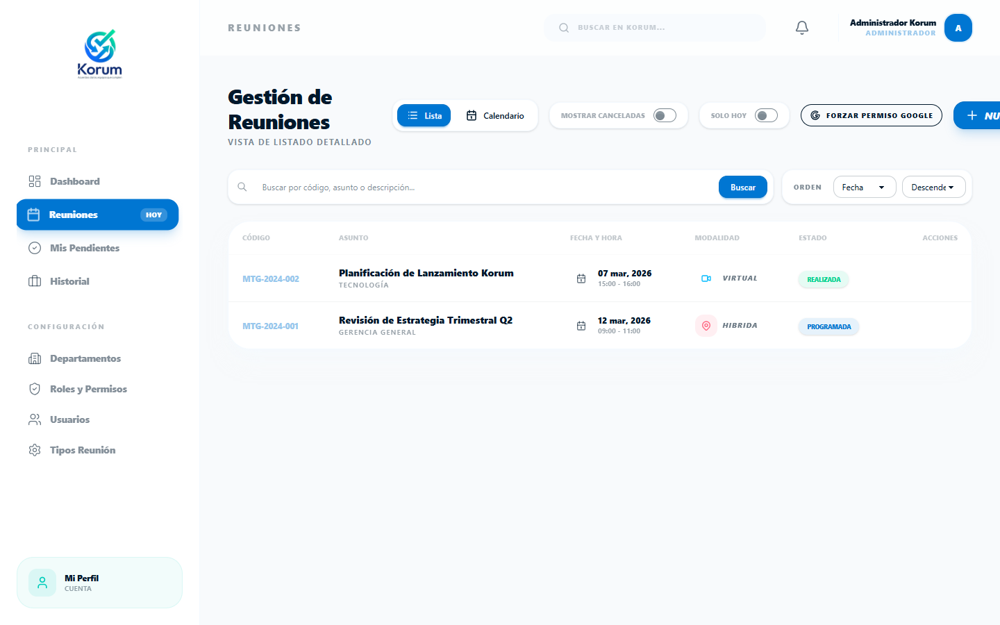

### 5.1 Acciones principales en el listado
1. **Buscar** por codigo, asunto o descripcion.
2. **Ordenar** por fecha, asunto, estado o codigo.
3. Activar **Solo Hoy** para ver solo reuniones del dia.
4. Usar el icono de ojo para abrir el detalle de una reunion.
5. Usar **Sincronizar Google** si tu cuenta esta conectada.

### 5.2 Filtro Solo Hoy
Cuando activas **Solo Hoy**, el listado se limita a reuniones de la fecha actual.

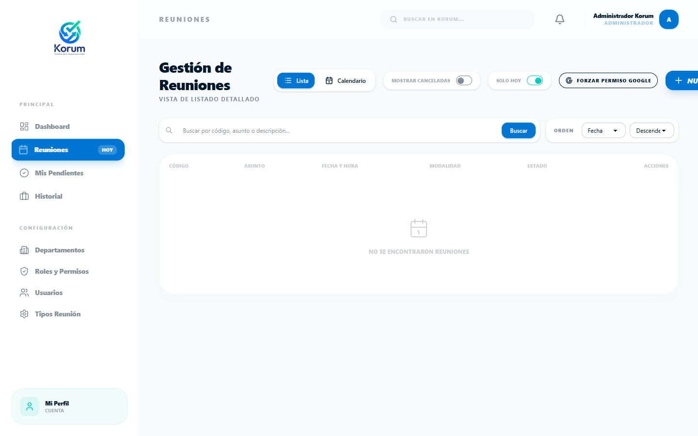

## 6. Detalle de una reunion
Al abrir una reunion, veras 3 etapas:
- **Antes** (planificacion),
- **Durante** (asistencia y desarrollo),
- **Despues** (resultados y minuta final).

### 6.1 Pestaña Antes
Aqui revisas informacion base y agenda.

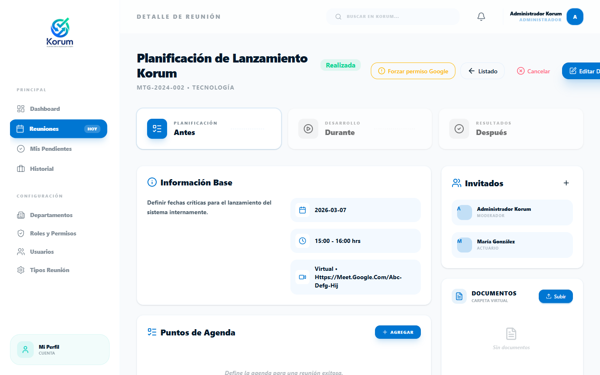

Acciones sugeridas:
1. Validar fecha, hora y modalidad.
2. Revisar invitados.
3. Confirmar puntos de agenda.

### 6.2 Pestaña Durante
Aqui se controla la asistencia y el desarrollo de la sesion.

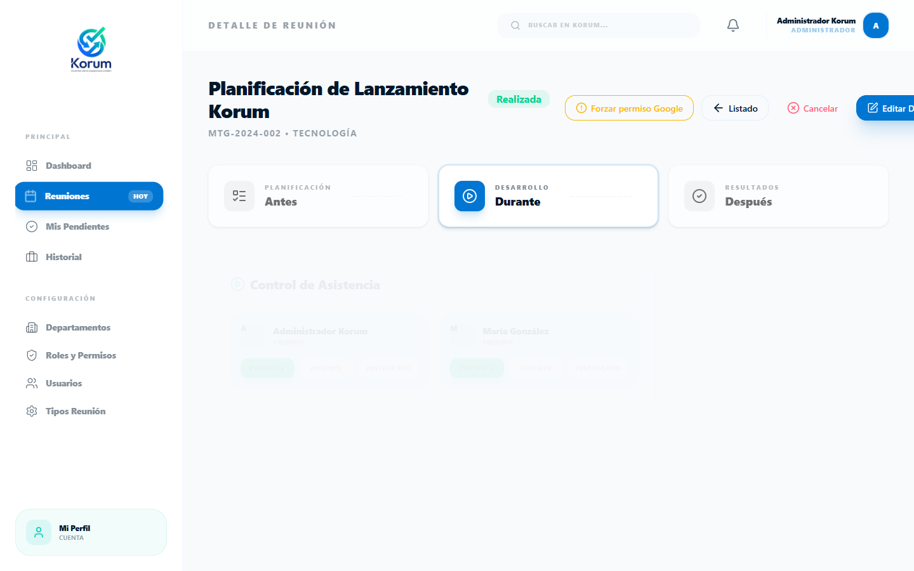

Pasos:
1. Marcar asistencia por cada invitado.
2. Verificar que no quede ningun participante sin estado.
3. Registrar temas tratados.

> Importante: para avanzar correctamente a **Despues**, la asistencia debe quedar marcada.

### 6.3 Pestaña Despues
En esta etapa se cierra la reunion y se accede al documento oficial.

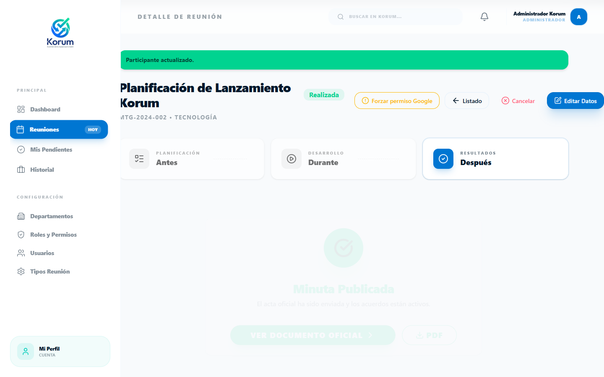

Acciones disponibles:
1. Preparar/continuar minuta.
2. Ver documento oficial.
3. Exportar PDF cuando este habilitado.

## 7. Minuta (documento oficial)
Cuando abres la minuta, se muestra el documento formal de la reunion.

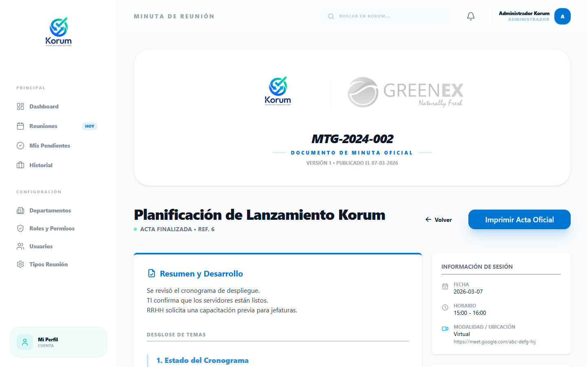

En la minuta debes verificar:
1. Encabezado y datos de sesion.
2. Resumen y desarrollo.
3. Temas tratados.
4. Decisiones y acuerdos.

### 7.1 Visualizacion final de minuta
La vista oficial permite revisar el contenido consolidado.

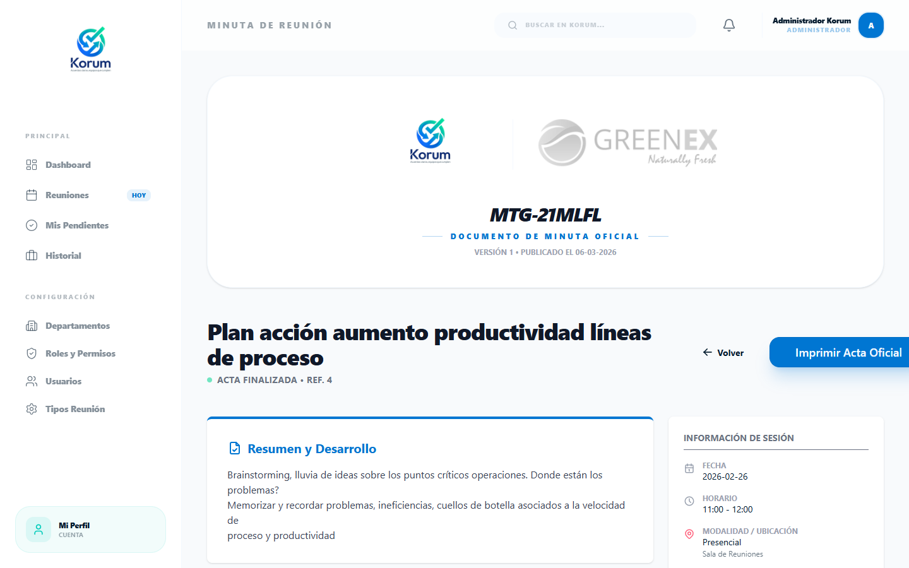

### 7.2 Impresion del acta oficial (PDF)
1. Presiona **Imprimir Acta Oficial**.
2. El sistema genera/abre el PDF del acta.
3. Guarda o imprime desde el visor PDF del navegador.

## 8. Acuerdos y compromisos
En este modulo puedes ver todos los acuerdos de reuniones finalizadas.

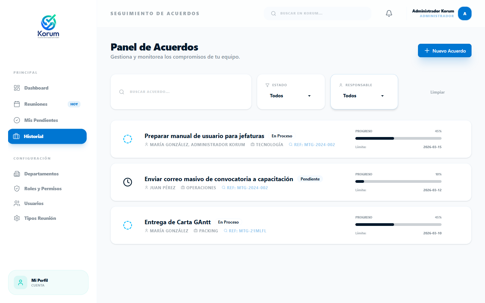

Pasos recomendados:
1. Abrir un acuerdo para revisar responsable y fechas.
2. Ver avances y estado.
3. Registrar actualizaciones cuando corresponda.

### 8.1 Detalle de acuerdo
En el detalle se concentra la trazabilidad del compromiso.

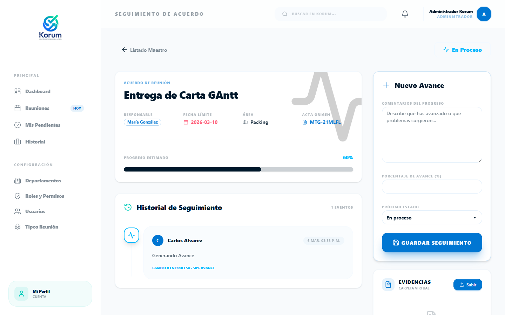

## 9. Perfil de usuario
Desde **Mi Perfil** puedes actualizar datos personales y configuraciones basicas.

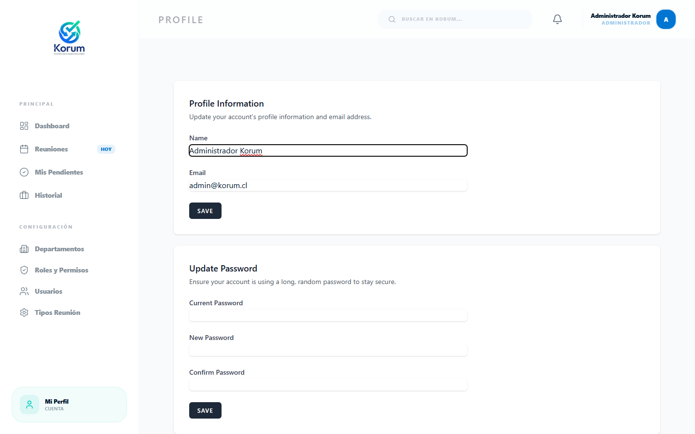

Uso sugerido:
1. Confirmar nombre y correo.
2. Cambiar clave si es necesario.
3. Mantener datos actualizados para notificaciones.

## 10. Buenas practicas para usuarios basicos
1. Revisa el listado de reuniones al iniciar tu jornada.
2. Usa el filtro **Solo Hoy** para enfocarte en lo urgente.
3. Marca asistencia en el momento real de la reunion.
4. Completa la minuta el mismo dia para evitar omisiones.
5. Revisa acuerdos pendientes semanalmente.

## 11. Problemas frecuentes y solucion rapida
### 11.1 No puedo avanzar de Durante a Despues
- Causa probable: falta marcar asistencia de uno o mas invitados.
- Solucion: vuelve a **Durante** y registra todos los estados.

### 11.2 No veo reuniones en Solo Hoy
- Causa probable: no hay reuniones programadas para hoy o filtros activos.
- Solucion: desactiva **Solo Hoy** y limpia busqueda.

### 11.3 No abre el PDF del acta
- Causa probable: bloqueador de ventanas o restriccion del navegador.
- Solucion: habilita ventanas emergentes para Korum y vuelve a intentar.

## 12. Flujo recomendado (resumen operativo)
1. Entrar a Korum.
2. Ir a **Reuniones**.
3. Abrir reunion del dia.
4. Revisar **Antes**.
5. Registrar asistencia y desarrollo en **Durante**.
6. Cerrar en **Despues** y preparar minuta.
7. Revisar e imprimir **Acta Oficial (PDF)**.
8. Dar seguimiento en **Acuerdos y Compromisos**.

---

Manual generado para capacitacion de usuarios basicos.
